<picture>
  <source media="(prefers-color-scheme: dark)" srcset="assets/header-dark.svg">
  
</picture>

  
  
  

 

I build **AI that understands connected data**. My work sits where knowledge graphs meet large language models: designing Neo4j graphs, building GraphRAG pipelines, and shipping the APIs and interfaces around them.

Most recently I was an **AI Engineer at Cernuvo**, building knowledge graph and GraphRAG features for a live platform serving thousands of users. I'm finishing my **MS in Information Systems at Northeastern** (Dec 2026) and I'm open to full-time AI, ML and full-stack AI roles from January 2027.

  <picture>
    <source media="(prefers-color-scheme: dark)" srcset="assets/terminal-dark.svg">
    
  </picture>

<picture>
  <source media="(prefers-color-scheme: dark)" srcset="assets/divider-dark.svg">
  
</picture>

## Featured work

<table>
<tr>
<td width="50%" valign="top">

### [GroundLink](https://github.com/nancytaswala23/groundlink)
**Distributed ground station task scheduler**

Allocates satellite downlink windows across 4 ground stations with an O(log n) priority queue. Detects station failures in real time and reassigns tasks with **zero task loss**, with a full PostgreSQL audit trail.

`Python` `FastAPI` `PostgreSQL` `Docker` `CI/CD`

</td>
<td width="50%" valign="top">

### [OrbitOps](https://github.com/nancytaswala23/kuiperops)
**AI satellite operations agent**

LLM agent that reads telemetry, detects 6 failure types and writes incident diagnoses and runbooks, cutting diagnosis time by **80%**. Structured output, retries and a fallback path keep every response usable.

`Python` `Llama 3` `FastAPI` `DynamoDB` `Docker`

</td>
</tr>
<tr>
<td width="50%" valign="top">

### [CrimeGraph](https://github.com/nancytaswala23/Crime-Investigation-Graph-Using-Neo4j)
**Knowledge graph investigation with RAG**

Ask questions in plain English over a Neo4j graph of **30K+ crime records**. LangChain RAG pipeline with entity extraction, data lineage, retrieval evaluation and guardrails, plus a React frontend.

`Neo4j` `LangChain` `RAG` `NLP` `React`

</td>
<td width="50%" valign="top">

### [EdgeSync](https://github.com/nancytaswala23/edgesync)
**Offline-first remote device sync**

Keeps devices in schools and hospitals working through outages by queuing 1,000+ records in SQLite and syncing to DynamoDB on reconnect, with three conflict strategies and **zero data loss**.

`Python` `SQLite` `AWS DynamoDB` `Docker`

</td>
</tr>
<tr>
<td width="50%" valign="top">

### [TrafficWatch](https://github.com/nancytaswala23/trafficwatch)
**Real-time satellite network monitor**

Streaming pipeline watching 5 satellite nodes across 4 continents. Z-score detection flags 2σ and 3σ deviations in bandwidth, latency and packet loss, with **live alerts** over Server-Sent Events.

`Python` `FastAPI` `SSE` `Anomaly Detection`

</td>
<td width="50%" valign="top">

### [BookShelf](https://github.com/nancytaswala23/BookShelf---A-Book-Recommendation-System)
**Published recommendation research**

Collaborative filtering with SVM, Random Forest and matrix factorisation on sparse rating data, improving accuracy by **35%** over baseline. [Published in IJSREM.](https://ijsrem.com/download/bookshelf-a-book-recommendation-system-using-collaborative-filtering/)

`Python` `Scikit-learn` `Flask` `Recommenders`

</td>
</tr>
</table>

<b>More projects</b>

 

**[MediHive](https://github.com/nancytaswala23/Hospital-Management-System)**: Role-based hospital management platform with a HIPAA-aware data governance framework and star schema models that reduced query latency by 60%. `Java` `SQL` `Power BI`

<picture>
  <source media="(prefers-color-scheme: dark)" srcset="assets/divider-dark.svg">
  
</picture>

## Tech stack

| | |
|---|---|
| **Languages** | Python, TypeScript, JavaScript, SQL, Cypher, Java, R |
| **AI and ML** | LLMs, GraphRAG, RAG, LangChain, Hugging Face Transformers, PyTorch, Scikit-learn, NLP |
| **Graphs and data** | Neo4j, PostgreSQL, MySQL, SQL Server, SQLite, AWS DynamoDB |
| **Full stack** | FastAPI, Flask, React |
| **Cloud and DevOps** | AWS (DynamoDB, Lambda, SQS), Docker, GitHub Actions |
| **Analytics** | Power BI, Tableau, AWS QuickSight |

<b>Experience and education</b>

 

**AI Engineer, Knowledge Graphs & GraphRAG** · Cernuvo · Jan 2026 to Jul 2026
Built Neo4j knowledge graphs, GraphRAG pipelines and FastAPI microservices for a live platform, working directly with the technical co-founder on architecture.

**Research Assistant** · Dept. of Data Science, University of Mumbai · Jun 2023 to Apr 2024
Led a recommendation systems study from scoping to peer-reviewed publication in IJSREM.

**Northeastern University** · MS Information Systems · Aug 2024 to Dec 2026

**University of Mumbai** · BS Data Science · 2021 to 2024

<picture>
  <source media="(prefers-color-scheme: dark)" srcset="https://raw.githubusercontent.com/nancytaswala23/nancytaswala23/output/github-snake-dark.svg">
  
</picture>

Always happy to talk knowledge graphs, GraphRAG and distributed systems.

